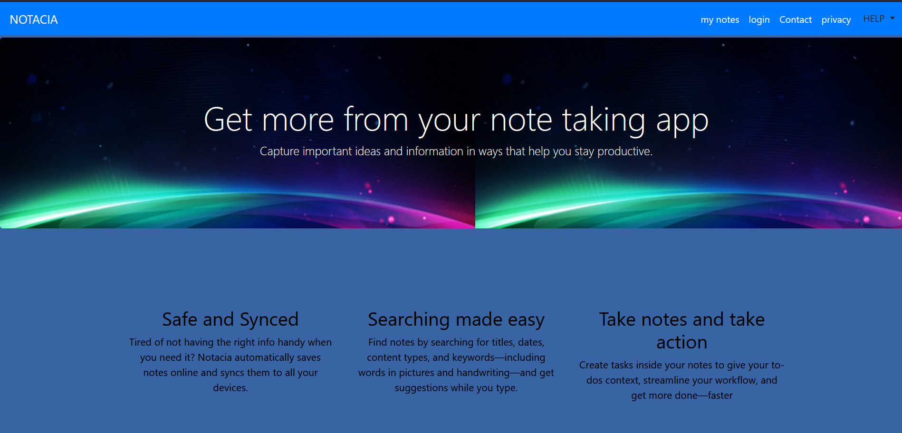

## GLIMPS:

## Project Name : Note Log :

Description : This project aims to create a notes app software application designed to help individuals create, organize, and manage their notes, ideas, and information digitally. This project will be implemented using HTML,CSS,Bootstrap and Javascript.

## Team Members:

  1. Manager: Navya(2310990749)
  2. Developer: Nandini(2310990747)
  3. Tester: Navjot(2310990748)

## Project Structure:

  1. HTML: The project utilizes HTML for structuring the note log and its content.
  2. CSS: CSS is employed for styling the note log, ensuring a visually appealing and consistent layout.
  3. Javascript: JavasScript is used to implement dynamic functionality and validation, enhancing user interactivity and ensuring data accuracy.

## Features:

  1. User-friendly layout
  2. Interactive elements for an engaging user experience
  3. Client-side validation using Javascript
  4. Responsive design to ensure compatibility with various devices and screen sizes.Our platform named as NOTACIA has many features
  5. Organised and add free
  6. Safe and Synced

## Problem statement: 
In both personal and professional contexts, individuals often need to keep track of various notes, ideas, tasks, and reminders. Existing solutions such as physical notebooks, basic text editors, and generic note-taking apps often fall short in addressing specific needs like organization, searchability, categorization, and cross-device accessibility. There is a need for a more efficient, feature-rich note log application that can cater to these requirements while being user-friendly and accessible.

## Objective: 
Allows users to create, edit, and delete notes easily.
Supports organization of notes through categories, tags, or folders.
Provides powerful search functionality to quickly locate notes.
Ensures cross-device synchronization so users can access their notes from anywhere.
Incorporates security measures to protect sensitive information.
Offers a clean, intuitive, and user-friendly interface.

## Feature timeline:

| Sr.No. | File Name | Features | Merged and pull request date | Time of commit | Done by |
| --- | --- | --- | --- | --- | --- |
| 1. | version 1 | basic layout of our home webpage | 07 May 2024 | 11:10 AM | Nandini |
| 2. | my app.js | updated javascript for homepage | 07 May 2024 | 3:30 PM | Navjot |
| 3. | version 2 | porgot password page and privacy policy page added | 08 May 2024 | 3:52 PM | Nandini |
| 4. | version 3 | contact page and terms & conditions page added | 12 May 2024 | 6:38 PM | Nandini |
| 5. | contact.html | updated javascript for contact page | 14 May 2024 | 1:33 AM | Nandini | 
| 6. | version 4 | developers page added | 14 May 2024 | 1:49 AM | Nandini |
| 7. | developers.html | developers page layout updated | 16 May 2024 | 9:36 PM | Nandini |
| 8. | version 5 | drawing page added | 17 May 2024 | 1:15 AM | Navya |
| 9. | draw.html | drwaing page layout updated | 17 May 2024 | 2:47 AM | Navya |

## About Every Version: 
Version1: It contains basic structure of our website. There was an issue raised regarding problem in the JavaScript code. Finally the new code was uploaded.
Version2: In version 2 we added some basic pages to our website i.e. are login page, register page and privacy page of our website.
Version3: In version 3 we added contact page and terms and condition page. There was some problem in code of contact page so it was changed and the issue was solved in new code.
Version4: In version 4 we added page that contain information about developers of this website and we added a page that contain homepage of our website 
Version5: Finally we added last version of our project that contain full and complete website  

